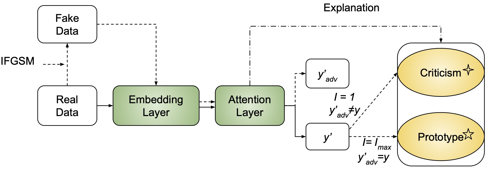

# Example-based Explanations with Adversarial Attacks for Respiratory Sound Analysis
[](https://arxiv.org/abs/2203.16141)
[](https://opensource.org/licenses/MIT)



This is a Python and PyTorch code for the prototype learning framework in our paper: 

<!--[Prototype learning for interpretable respiratory sound analysis].-->

>Yi Chang, Zhao Ren, Thanh Tam Nguyen, Wolfgang Nejdl, and Björn W. Schuller. Example-based Explanations with Adversarial Attacks
for Respiratory Sound Analysis. Accepted by INTERSPEECH 2022. 

## Citation

```
@inproceedings{chang22h_interspeech,
  author={Yi Chang and Zhao Ren and Thanh Tam Nguyen and Wolfgang Nejdl and Björn W. Schuller},
  title={{Example-based Explanations with Adversarial Attacks for Respiratory Sound Analysis}},
  year=2022,
  booktitle={Proc. Interspeech 2022},
  pages={4003--4007},
  doi={10.21437/Interspeech.2022-11355}
}
```

## Abstract

Respiratory sound classification is an important tool for remote screening of respiratory-related diseases such as pneumonia, asthma, and COVID-19. To facilitate the interpretability of classification results, especially ones based on deep learning, many explanation methods have been proposed using 
prototypes. However, existing explanation techniques often assume that the data is non-biased and the prediction results can be explained by a set of prototypical examples. In this work, we develop a unified example-based explanation method for selecting both representative data (prototypes) and outliers (criticisms). In particular, we propose a novel application of adversarial attacks to generate an explanation spectrum of data instances via an iterative fast gradient sign method. Such unified explanation can avoid over-generalisation and bias by allowing human experts to assess the model mistakes case by case. We performed a wide range of quantitative and qualitative evaluations to show that our approach 
generates effective and understandable explanation and is robust with many deep learning models. 

## Preprocessing
```
python preprocessing/preprocessing.py

python preprocessing/data_split.py

```

## Training and Test
1. For CNN-8 and ResNet development:
```
sh run.sh
```
2. For prototype and criticisms selection: 
```
sh adv.sh
```


